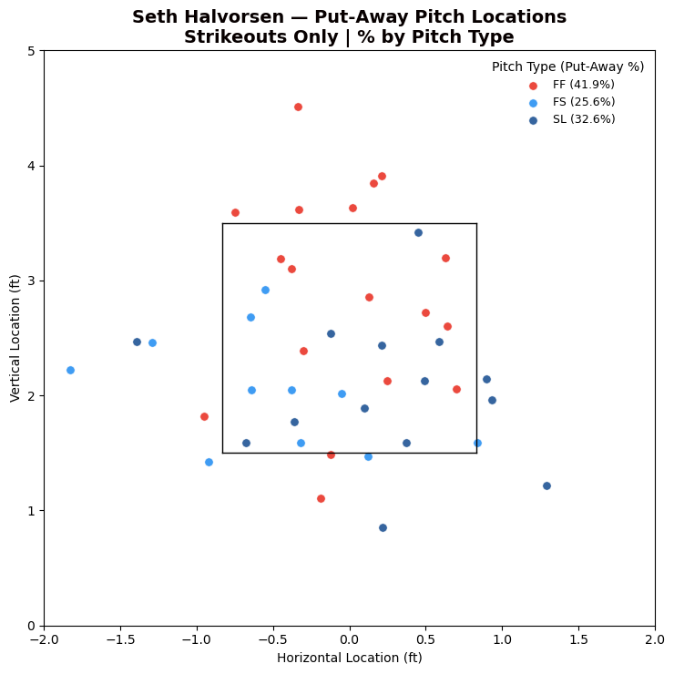

# MLB Put Away Pitches
Statcast data used to track strike out pitches used by a pitcher throughout a single or multiple games.

## Features

- Pitcher lookup by name (no Statcast ID required)
- CSV caching of data
- Clean strike-zone visualization
- Pitch-type usage percentages
- Fully customizable color theme

## Data Source

- MLB Statcast data accessed via the `pybaseball` library
- Pitch data includes pitch type, location, and outcome

## How It Works

- Pitcher name and date range entered
-  Pitcher’s Statcast ID resolved automatically
-  Pitch Statcast data pulled once and cached locally as a CSV file
-  Put-away pitches (strikeouts only) filtered
-  Pitch locations plotted by pitch type, usage percentage included in legend

## Customizing Colors:
- Edit hex values or click on color to select manually

## Author
Paul Schaefer
- MLB Gameday Compliance Officer & Data Operator
- University of Toronto — Data Analytics Certificate
